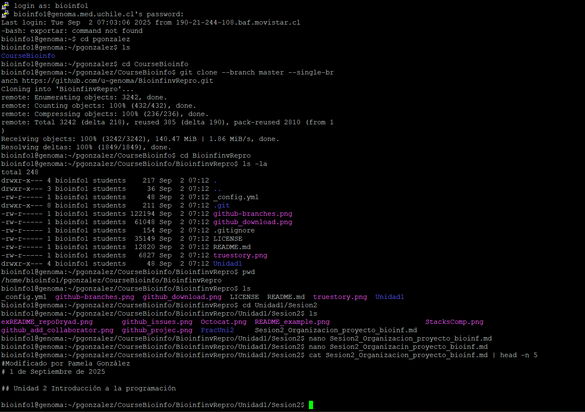
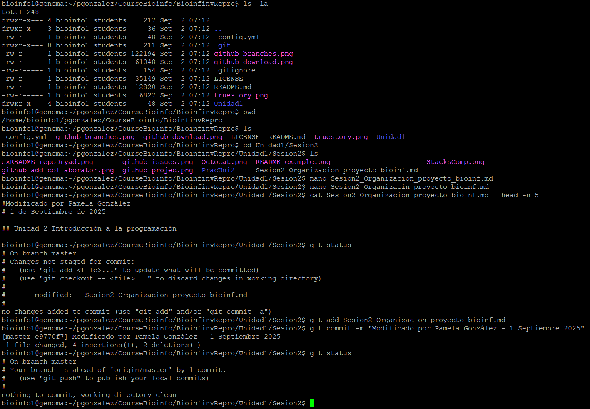
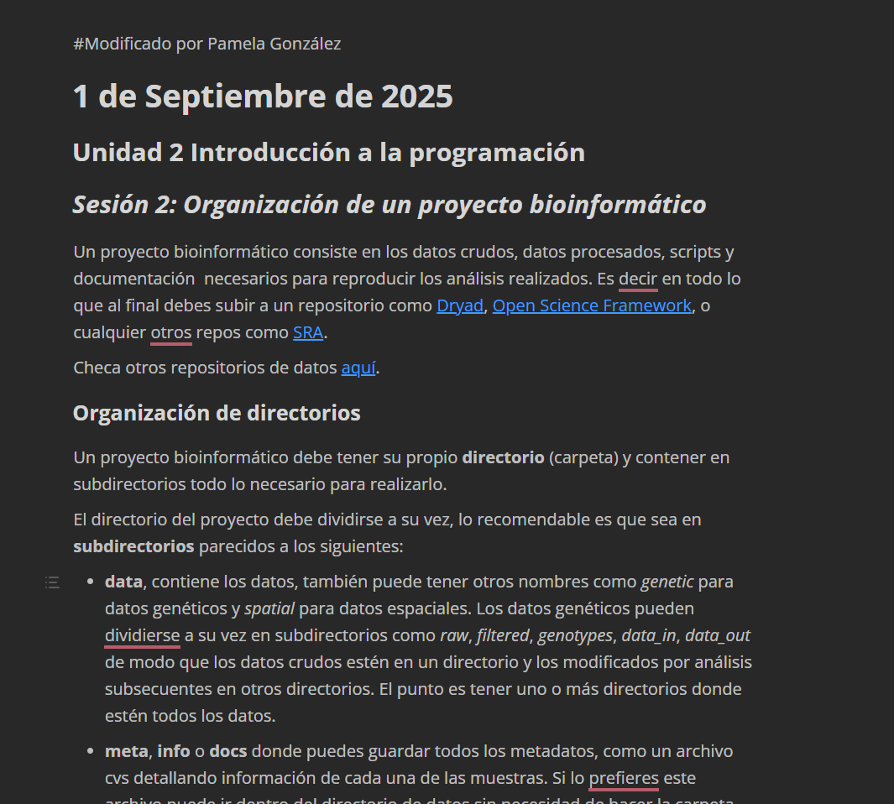

# INFORME TAREA 2
# Informe Tarea 1.2

Este informe documenta los pasos realizados en la Tarea 1.2 del curso de Bioinformática y Proyecto de Investigación. Incluye la práctica inicial en MarkText, así como las evidencias del uso de Git y la verificación de los cambios realizados.

---

## 0. Archivo de práctica en MarkText

El archivo **`Tarea_Session_2_Prueba_Marktext.md`** corresponde al **primer ejercicio solicitado en la Sesión 2**.  
Este ejercicio consistía en modificar un documento en MarkText y guardar los cambios en formato Markdown.  
Ese archivo se encuentra dentro de la carpeta de la tarea y representa el resultado directo de la práctica inicial.

---

## 1. Clonación del repositorio

En la **Figura 1** se muestra el resultado de la clonación del repositorio del curso en mi carpeta de trabajo.  
Esto confirma que la descarga del repositorio desde GitHub se realizó correctamente.

---

## 2. Commit de los cambios

En la **Figura 2** se observa la ejecución de `git status` después de modificar el archivo.  
La imagen muestra que los cambios fueron detectados y preparados para ser confirmados mediante un **commit**, cumpliendo con la segunda parte del ejercicio.

---

## 3. Visualización en MarkText

En la **Figura 3** se aprecia la visualización del archivo modificado dentro de MarkText.  
Aquí se evidencia que la modificación fue aplicada correctamente, cumpliendo con el **primer ejercicio de edición en Markdown**.

---

## Conclusión

Con esta práctica logré:  
1. Clonar el repositorio en un directorio limpio.  
2. Editar un archivo en MarkText y guardarlo en formato Markdown.  
3. Comprobar los cambios con `git status` y realizar un commit.  
4. Documentar todo el proceso en este archivo `Informe_Tarea_1.2_Explicacion.md` con capturas de pantalla y explicaciones detalladas.

